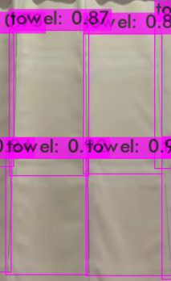

# VisionFabric - Custom YOLO Object Detection Training & Inference

A complete pipeline for training custom YOLO models and performing video inference for object detection and tracking.



## 🚀 Quick Start

This project provides a complete workflow for:
1. **Data Preparation** - Extract and annotate video frames
2. **Model Training** - Train custom YOLO model on Google Colab
3. **Video Inference** - Real-time object detection and tracking

## 📋 Prerequisites

- Python 3.7+
- OpenCV
- Google Colab account (for training)
- Video files for frame extraction

## 🎯 Step 1: Data Preparation

### Extract Frames from Video

Extract 100-200 frames from your video files using any video processing tool or Python script:

```python
import cv2
import os

def extract_frames(video_path, output_dir, max_frames=200):
    cap = cv2.VideoCapture(video_path)
    frame_count = 0
    
    while frame_count < max_frames:
        ret, frame = cap.read()
        if not ret:
            break
        
        cv2.imwrite(f"{output_dir}/frame_{frame_count:06d}.jpg", frame)
        frame_count += 1
    
    cap.release()
```

### Annotate Images with LabelImg

1. **Install LabelImg:**
   ```bash
   pip install labelImg
   ```
   
   Or clone from GitHub:
   ```bash
   git clone https://github.com/HumanSignal/labelImg.git
   cd labelImg
   pip install -r requirements.txt
   python labelImg.py
   ```

2. **Annotation Process:**
   - Launch LabelImg: `labelImg`
   - Open your extracted frames directory
   - Set save format to **YOLO**
   - Create bounding boxes around objects
   - Save annotations (creates `.txt` files)

3. **File Structure:**
   ```
   obj/
   ├── frame_000001.jpg
   ├── frame_000001.txt
   ├── frame_000002.jpg
   ├── frame_000002.txt
   └── ...
   ```

## 🔥 Step 2: Model Training (Google Colab)

### Upload Required Files to Colab

1. **Zip your annotated dataset:**
   ```bash
   zip -r obj.rar obj/
   ```

2. **Upload to Colab:**
   - `obj.rar` (your annotated dataset)
   - `custom-tiny.cfg` (configuration file for 1 class)
   - `obj.data` (dataset configuration)
   - `obj.names` (class names)

### Training Configuration

The project includes a pre-configured setup for **1 class detection**:

- **`obj.names`**: Contains class names
  ```
  towel
  ```

- **`obj.data`**: Dataset paths and configuration
  ```
  classes=1
  train=data/train.txt
  valid=data/valid.txt
  names=data/obj.names
  backup=backup
  ```

- **`custom-tiny.cfg`**: YOLOv4-tiny configuration optimized for single class

### Run Training Notebook

Use the provided `training.ipynb` notebook in Google Colab:

1. **Setup Environment:**
   - Clones Darknet repository
   - Configures GPU, CUDNN, and OpenCV support
   - Compiles Darknet

2. **Data Preparation:**
   - Extracts your dataset
   - Splits data into train/validation sets (90/10)
   - Creates training and validation text files

3. **Training Process:**
   - Downloads pre-trained weights
   - Starts training with mAP calculation
   - Saves best weights in `backup/` directory

4. **Testing:**
   - Tests trained model on sample images
   - Displays detection results

### Training Commands Explained

```python
# Setup Darknet with GPU support
!git clone https://github.com/AlexeyAB/darknet
!sed -i 's/GPU=0/GPU=1/' Makefile
!make

# Extract dataset
!unrar x /content/obj.rar /content/darknet/obj

# Train model
!./darknet detector train data/obj.data cfg/custom-tiny.cfg yolov4-tiny.conv.29 -map -dont_show

# Test trained model
!./darknet detector test data/obj.data cfg/custom-tiny.cfg backup/towel-tiny_best.weights test_image.jpg
```

## 📁 Project File Structure

```
VisionFabric/
├── training.ipynb          # Google Colab training notebook
├── Inference.py           # Video inference script
├── custom-tiny.cfg        # YOLO configuration (1 class)
├── obj.data              # Dataset configuration
├── obj.names             # Class names
├── towel-tiny_best.weights # Trained model weights
├── requirements.txt       # Python dependencies
├── sort.py               # For Tracking
├── image.png             # Sample detection result
└── README.md             # This file
```

## 🎥 Step 3: Video Inference

After training, download these files from Colab:
- `towel-tiny_best.weights` (trained weights)
- `custom-tiny.cfg` (configuration file)
- `obj.data` (data configuration)
- `obj.names` (class names)

### Setup Inference Environment

1. **Install dependencies:**
   ```bash
   pip install -r requirements.txt
   ```

2. **Run video inference:**
   ```bash
   python Inference.py
   ```

### Inference Features

The `Inference.py` script provides:

- **Real-time object detection** using trained YOLO model
- **Object tracking** with SORT algorithm
- **Crossing detection** for counting objects
- **Video output** with bounding boxes and tracking IDs
- **CSV logging** of detection results

### Configuration

Modify these parameters in `Inference.py`:

```python
CFG_PATH = 'custom-tiny.cfg'
WEIGHTS_PATH = 'YOUR_Trained_MODEL.weights'
NAMES_PATH = 'obj.names'
VIDEO_INPUT = 'your_video.mp4'
VIDEO_OUTPUT = 'output_video.avi'

CONF_THRESHOLD = 0.4  # Detection confidence
NMS_THRESHOLD = 0.4   # Non-maximum suppression
```

## 🛠️ Customization Options

### For Different Classes

1. **Update `obj.names`** with your class names
2. **Modify `obj.data`** to set correct number of classes
3. **Adjust `custom-tiny.cfg`**:
   - Change `classes=` in `[yolo]` layers
   - Update `filters=` in layers before `[yolo]` to `(classes + 5) * 3`

### Training Parameters

In `custom-tiny.cfg`:
- `max_batches`: Set to `classes * 2000` (minimum 4000)
- `steps`: Set to 80% and 90% of max_batches
- `width/height`: Input resolution (multiples of 32)

## 📊 Results and Evaluation

The training notebook provides:
- **mAP (mean Average Precision)** calculations
- **Loss curves** during training
- **Sample detection results** on test images
- **Model performance metrics**

## 🔧 Troubleshooting

### Common Issues

1. **Out of Memory:** Reduce batch size in cfg file
2. **Low mAP:** Increase training iterations or improve dataset quality
3. **No detections:** Lower confidence threshold or retrain with more data

### Performance Tips

- Use **416x416** input resolution for balance of speed/accuracy
- Ensure **high-quality annotations** for better results
- **Augment dataset** if you have limited training data
- Monitor **loss curves** to avoid overfitting

## 📈 Additional Enhancements

You can enhance this project by adding:

1. **Data Augmentation** - Increase dataset diversity
2. **Multi-Class Detection** - Extend to multiple object types
3. **Real-time Streaming** - Live camera feed processing
4. **Model Optimization** - TensorRT, ONNX conversion
5. **Web Interface** - Flask/FastAPI for web deployment
6. **Mobile Deployment** - TensorFlow Lite conversion
7. **Precision/Recall Analysis** - Detailed evaluation metrics
8. **Hyperparameter Tuning** - Grid search for optimal parameters

## 📝 License

This project is open source. Feel free to modify and distribute.

## 🤝 Contributing

Contributions are welcome! Please feel free to submit a Pull Request.

---

**Happy Training! 🚀**

For questions or issues, please open an issue in the repository.
